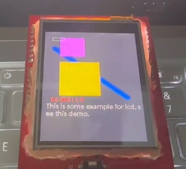

# Infineon Psoc6-evaluationkit-062S2 说明

## 简介

本文档为 `RT-Thread` 为 `PSoC6 CY8CKIT-062S2-43012`开发板提供的 BSP (板级支持包) 说明。

This is a fast display driver for interfacing ILI9341 LCD display with infineon microcontroller over an 8bit parallel (8080-II/I) bus. It's mainly written for my personal usage.

## 开发板介绍

`Psoc6-evaluationkit-062S2` 是 RT-Thread 联合英飞凌推出的一款集成32位双核CPU子系统（ ARM Cortex-M4 和 ARM Cortex-M0）的开发板，其具有单周期乘法的150-MHz Arm Cortex-M4F CPU (浮点和存储器保护单元)，100-MHz Cortex M0+ CPU，带单周期乘法和MPU，可以充分发挥 PSoC6 双核芯片性能。

该开发板核心 **板载资源** 如下：

- MCU：CY8C624ABZI-S2D44，Cortex-M4主频 150MHz，Cortex-M0主频 100MHz，2MB Flash 和 1MB SRAM
      MCU手册更多详细信息请参考文档 [PSoC 6 MCU: CY8C62x8, CY8C62xA Datasheet (infineon.com)](https://www.infineon.com/dgdl/Infineon-PSOC_6_MCU_CY8C62X8_CY8C62XA-DataSheet-v17_00-EN.pdf?fileId=8ac78c8c7d0d8da4017d0ee7d03a70b1)
- 板载资源：microSD card , 触摸滑条，Arduino 接口
- 开发环境：ModusToolbox 2.0/MDK V5
   PSoC® Creator™ 下载链接 [ModusToolbox™ Software - Infineon Technologies](https://www.infineon.com/cms/en/design-support/tools/sdk/modustoolbox-software/)

## 外设支持

本 BSP 目前对外设的支持情况如下：

| **片上外设** | **支持情况** | **备注** |
| :----------: | :----------: | :------: |
|  USB 转串口  |     支持     |  UART0   |
|     GPIO     |     支持     |    —     |
|     UART     |     支持     | UART0-5  |
|    Touch     |     支持     | 触摸滑条 |

## 目前支持

- [x] Support Arduino (simple, there are a few funtions to use ardino in rtt sdk)
- [x] LCD display (8080, ILI9341)
- [ ] ...

## 快速上手

本 BSP 是以 `VS Code` 和 `RT-Thread Studio` 为开发环境，接下来介绍如何将系统运行起来。

### VS Code 开发

#### 硬件连接

使用数据线连接开发板到 PC。

#### 编译下载

## 运行结果

下载程序成功之后，系统会自动运行。打开终端工具串口助手，选择波特率为 115200。复位设备后，而且在终端上可以看到 `RT-Thread` 的输出信息：

```bash
 \ | /
- RT -     Thread Operating System
 / | \     4.1.1 build Jul 25 2022 18:03:35
 2006 - 2022 Copyright by RT-Thread team
msh >
```

If you want to show lcd demo, you can input `lcd_demo` to entry, see:

```bash
 \ | /
- RT -     Thread Operating System
 / | \     4.1.1 build Jul 25 2022 18:03:35
 2006 - 2022 Copyright by RT-Thread team
msh > lcd_demo
msh > 
```

demo:  



## 代码

Define pinouts to connect LCD board.

```c++
uint8_t LCD_CS = A3;    // Chip Select goes to Analog 3
uint8_t LCD_CD = A2;    // Command/Data goes to Analog 2
uint8_t LCD_WR = A1;    // LCD Write goes to Analog 1
uint8_t LCD_RD = A0;    // LCD Read goes to Analog 0
uint8_t LCD_RESET = A4; // Can alternately just connect to Arduino's reset pin
uint8_t d8[] = {D8, D9, D2, D3, D4, D5, D6, D7}; // write/read the data of 8 pinouts
TFTLCD tft = TFTLCD(LCD_CS, LCD_CD, LCD_WR, LCD_RD, LCD_RESET, 240, 320, d8);
```

`tft.begin()`: initialize the lcd device.  
`tft.setRotation(x)`: set `0-3`, set rotatation.  
`tft.fillScreen(color)`: set color to full background.  
`tft.drawPixel(x, y, color)`:  
`tft.drawLine(x,y,w,h,l,color)`: set position to `(x,y)`, set width to `w`, set height to `h`, set line width to `l` .  
`tft.fillRect(x,y,w,h,color)`: same as `drawLine` usage.  
`tft.drawRectangle(x,y,w,h,color)`: same to `drawLine`.  
`tft.drawChar(x,y,char,front_color,back_color,font,is_bg)`: `font`: see application/font.  
`tft.drawString(x,y,string,front_color)`  

> **Can see lcd sources to get information.**

[github](https://github.com/rx-ted/infineon-psoc-62)

## 联系人

维护人:

- [Rbb666](https://github.com/Rbb666)
